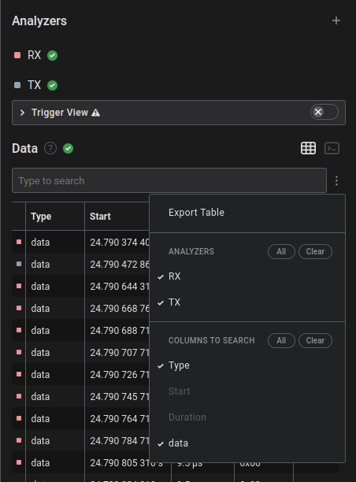
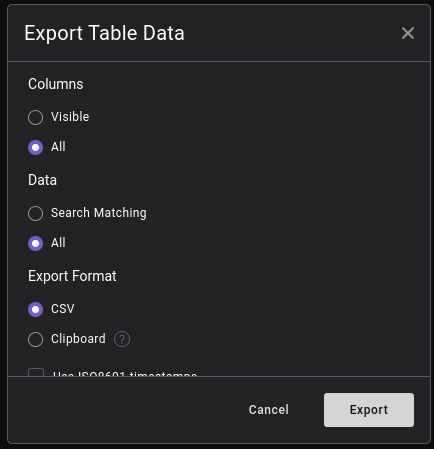

# UART Bluetooth Logger using Saleae Logic2

## Hardware Setup

Connect the probes as follows:
- Digital Channel 0: Bluetooth RX
- Digital Channel 1: Bluetooth TX

## How to use it

Capture a trace of the Bluetooth communication in the Logic2 app as usual. Activate the analyzers "Async Serial" for RX and TX. Select "Show in Data Table" and "Hexadecimal". In the Data Table section export RX and TX to a csv file.

Then, check out the complete bluetooth-logger repo and process the trace like this:

    $ cd salea-logic2-uart
	$ ./process_data_table.py filename.csv

It will create filename.pklg in the current dircetory. The .pklg file can be opened by Apple's PacketLogger and Wireshark.

